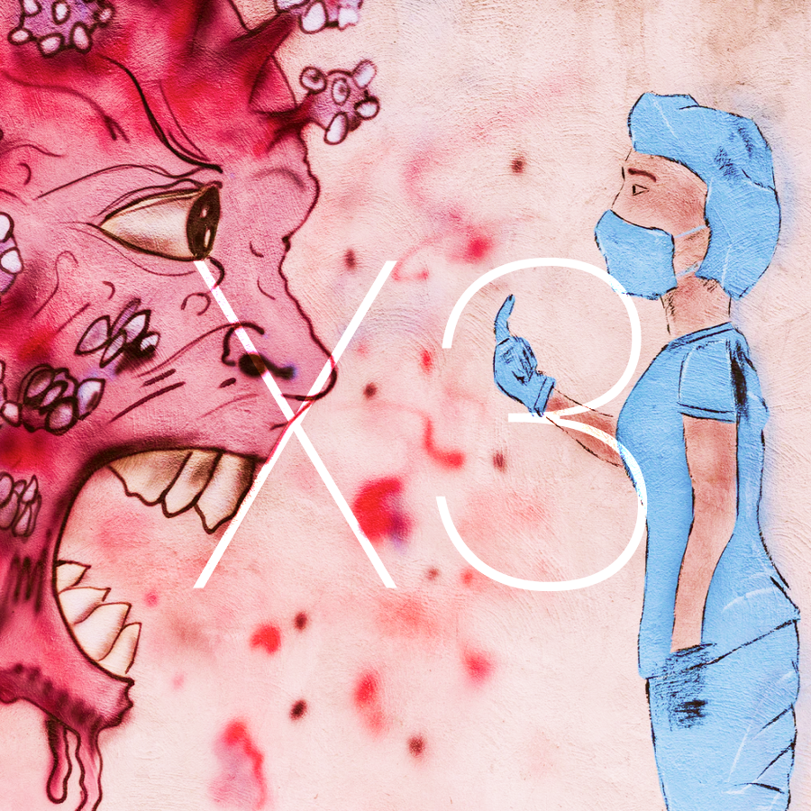
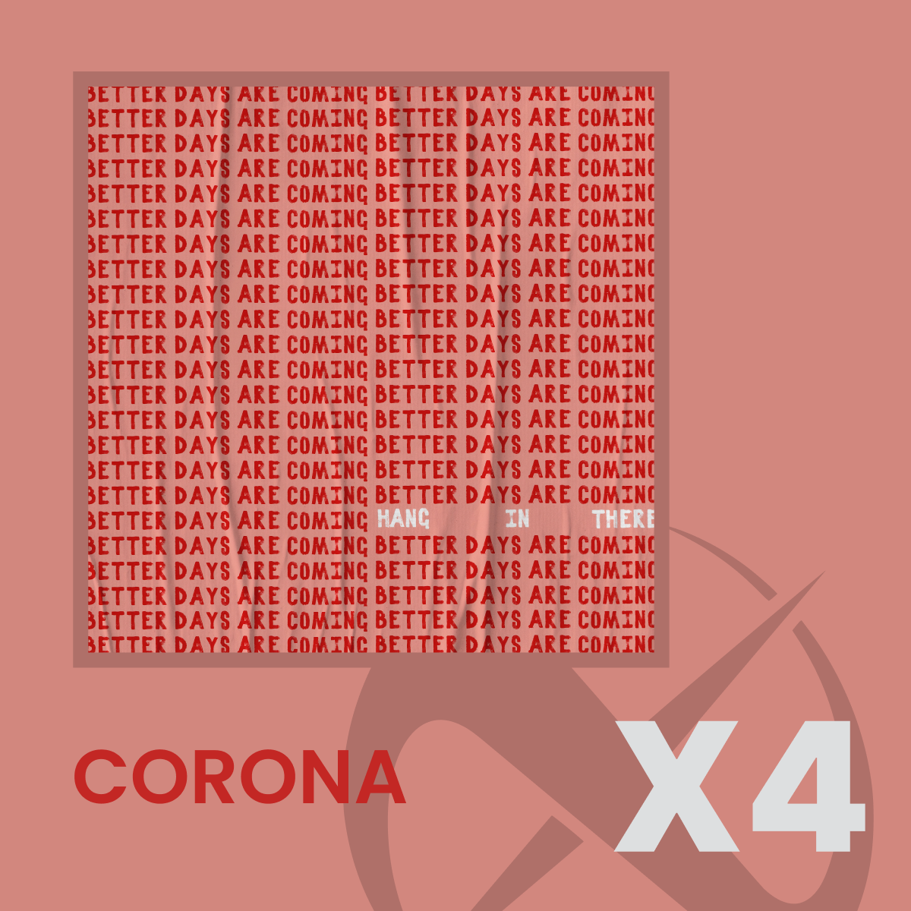
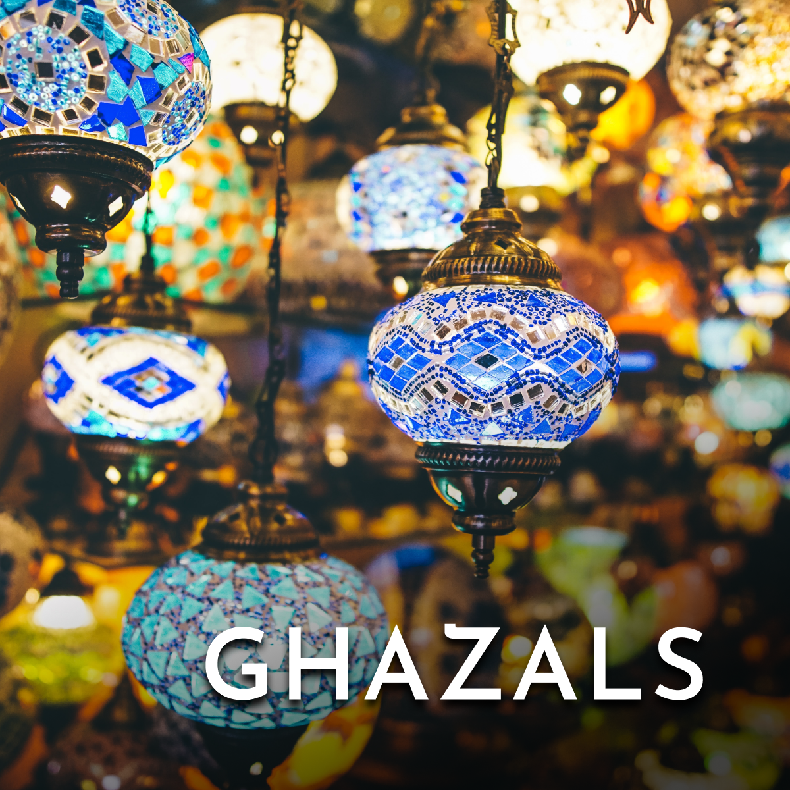
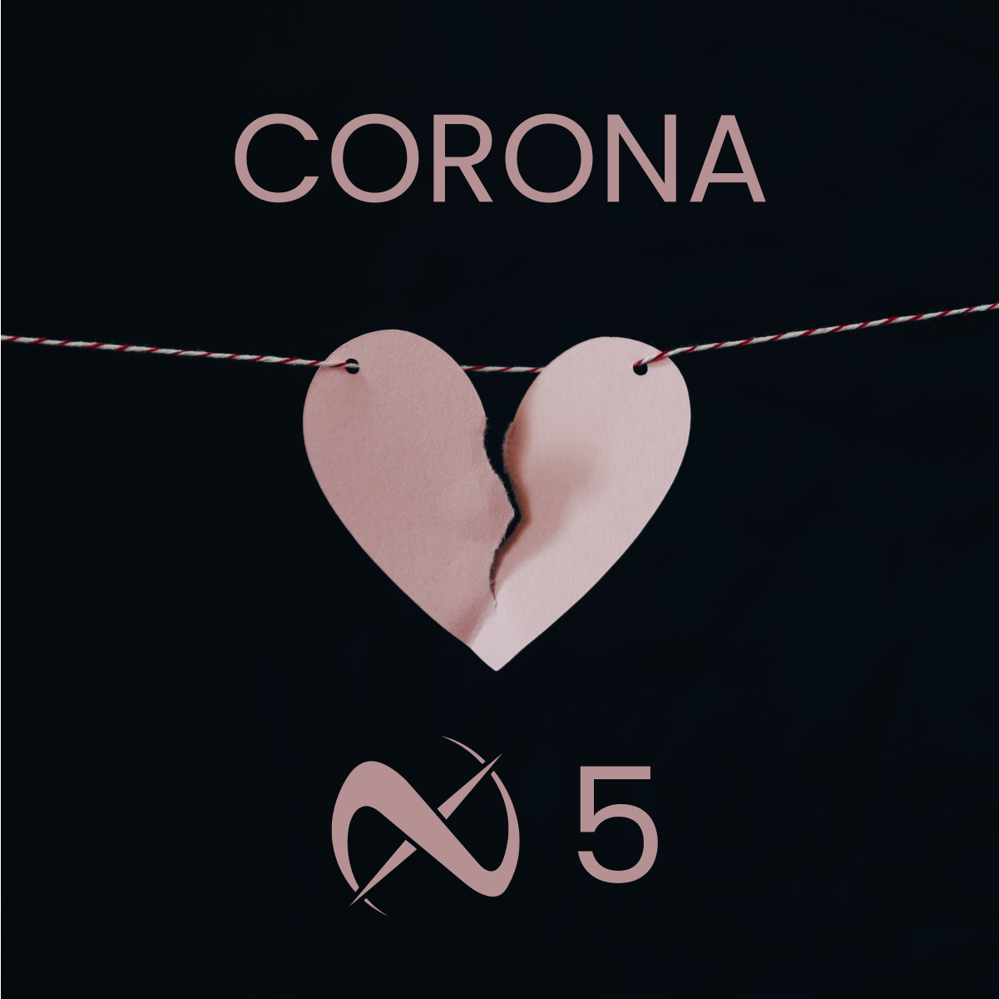
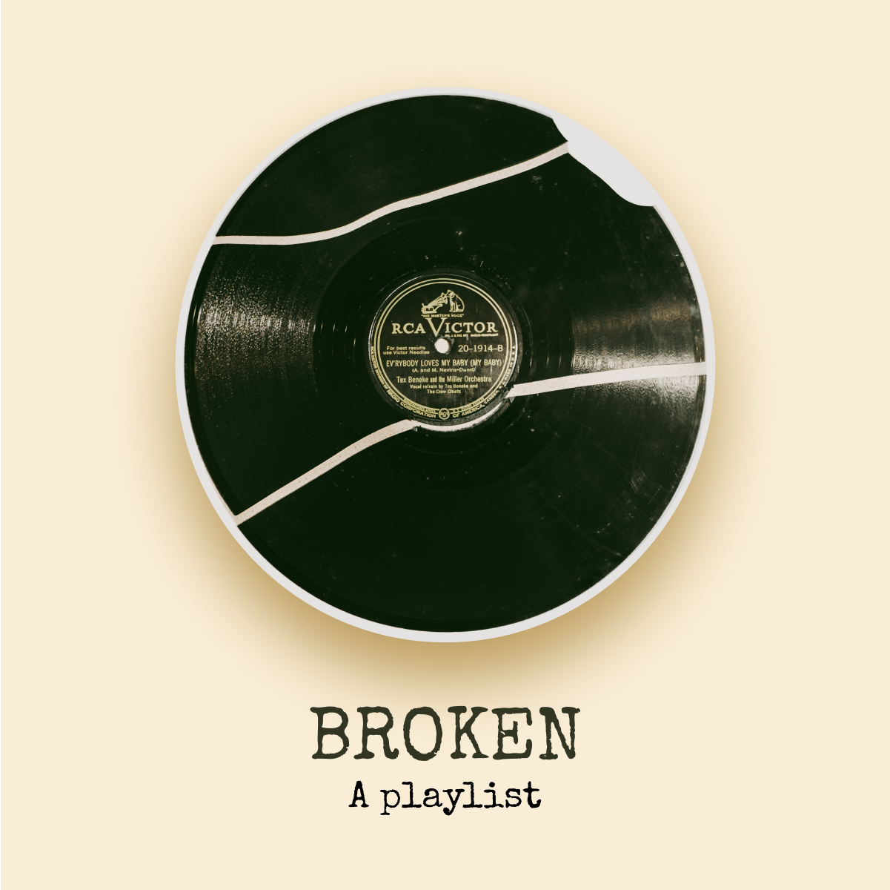
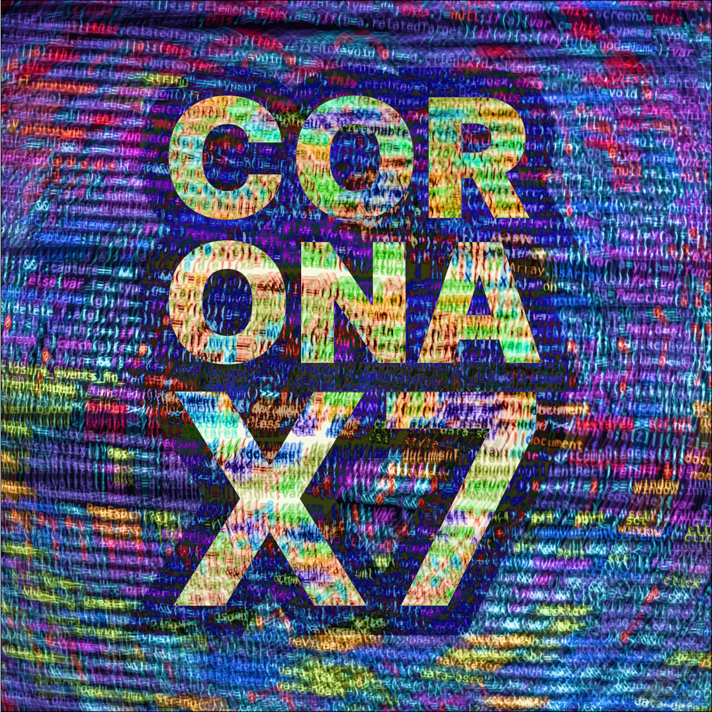
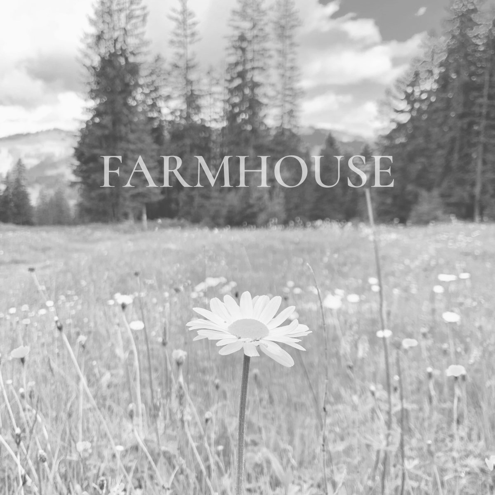
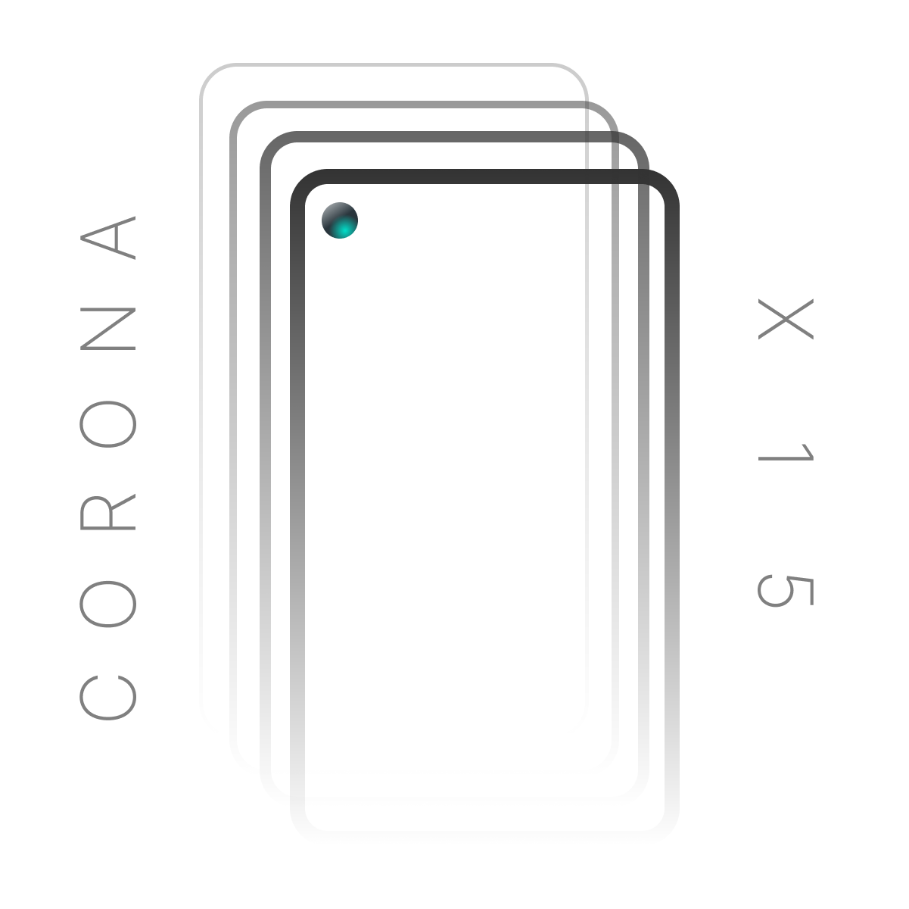

+++
title = "Custom Spotify Covers"
description = "The covers I have made for my Spotify Playlists for fun."
date = 2020-11-03
draft = true

[taxonomies]
categories = ["design"]
tags = ["design", "spotify"]

[extra]
metadata_image = "/posts/custom-spotify-covers/social_image.png"
hide_toc = true

+++


A few covers I have made. Discussed in detail in the post below.


I started creating covers for my Spotify Playlists earlier this year, near about

## Managing Music

How the covers are created needs a discussion of what the covers are being created for. And this means a discussion on how I create playlist i.e. what songs I put together. 

I always keep one playlist that contains all the songs that I have recently listened to that I would like to listen again. All of the songs from YouTube, Spotify's radio, soundtracks of the content I am binging, songs posted on music forums, shared by friends go into this playlist. I use this playlist as background music while programming or doing any work and also for casual listening. 

As the playlist increases in size, I create a new one. And the new one becomes the current playlist. Thus, I have a current playlist and a set of previous playlists with the *on loop* songs of that time. It nicely forms a historic record of what I was listening at a given point of time.

I started naming them with year and month as *YYYYxMM*, for January 2020 it was 2020x1. Or in another way, the first playlist of 2020. This trend continued till March after which Quarantine happened. At the start, I was hopeful, so I had a single playlist named Corona. But then the lockdown got extended and next versions started popping up, CoronaX2, CoronaX3 etc. And now I am on my 16th playlist XD. (*And sadly there is no end in sight!*)

There are some obvious flaws with this main approach, almost all of the songs in the playlist are different. It rarely ever carries a theme connecting all the songs together. Therefore, finding songs and playing something on occasion becomes a chore of remembering when you used to listen to a song and locating that playlist accordingly.

To subvert this, I have also started making thematic playlists. And these are themed with *playing opportunities*, the specific scenarios in which I may ever play a song. I had a couple of these earlier but they were mostly bassy bangers for parties. As I don't put much effort in thematic playlists, mainly because lockdown hasn't presented any good *playing opportunities*.

With these out of the way, let us discuss the general method of how I create the covers.

## The Process

I usually start by selecting a theme I am going for. For chronological playlists, therefore, the theme for these becomes whatever is going on in my life. With a theme decided, I head on to Unsplash and choose an image that I can use as the backbone for the cover design.

With the image selected, I use Figma to try out a few variations of typography and gradients, sometimes overlay filters, shadows and abstract shapes etc. I use a 1200x1200 square for the cover size and group all elements together. With a few more minutes of tweaking and testing, I export the image as JPEG (Spotify for some reason doesn't support PNG). 

This whole exercise from choosing a theme to a final cover image usually takes me about 15 minutes. I try to limit the time I spend on tweaking and try to finish a cover as soon as possible. As it is only for my personal use I don't have to obsess too much over the overall quality and I only have to please myself, no one else.

## The covers

### CoronaX3

We start our journey with X3, the first custom cover I made that wasn't just an image ripped off of Unsplash. It is an image ripped off of Unsplash, but the difference is that it has the X3. Specifying that it is the cover of the CoronaX3 playlist. The background image is self explanatory!

### CoronaX4

A bit more hopeful, a bit too complex. When I made this cover, I was viewing it in figma, full on zoomed to a large proportion. Thus, I put in detail that was illegible at the size it was displayed in my Spotify playlist, a meager 220px square. That is why the highlighted text visible at this large size is unreadable on Spotify. This was a guiding lesson and all other covers were made with the actual size in mind.

### Ghazals

In between the quarantine, a friend of mine shared with me a long YouTube playlist of Ghazals. I took some of what I heard there and some that I had heard earlier and put them into this playlist. For the visuals, I looked for something that resonated with *sufi, elegant, peaceful.* 

### CoronaX5

This heart shaped image caught my eye as soon as I saw it. This image was crying out to be a cover for a playlist and it became the cover of CoronaX5. If you asked an English teacher to point out the meaning of the image, you will get perhaps a trilogy of thick novels. The truth is simpler, it's just a paper heart tearing itself apart.

### Classical Melodies

When I was a child, with barely the sense of the world, my parents owned a cassette player and I heard a lot of the Hindi Classics on that player. Which is why the cover of this playlist is a cassette.

### Broken

Just a playlist that is broken.

### CoronaX6

Depicting the extended usage of screens and social media, this cover consists of the typical quarantining human. Also, the way 6 fits in the curve of the neck is just beautiful.

### CoronaX7

Ah, this was made during the part of my internship where I worked from 9 in the morning till about 9 to 10 in the night. And all of it was mostly code. That is why it is all code and evokes the same overwhelming feeling that you will get if you worked at a similar schedule.

### Farmhouse

A playlist for the songs that give you the old country feeling, even though I have never experienced it first hand. The background image was colorful but de-saturating it gave it a more peaceful look.

### CoronaX8

Confusion with the world and with myself in general. Why is the world whizzing by and I am stuck on a stand still? The image has been given a green tint to get the matrix look. The font is also monospace for a similar feel.

### CoronaX9

A peaceful paradise. A calm beach and timeless lighthouse. Pastel colors, thin font. Similar to a few songs on the playlist and a liberated mood of that time.

### Nightsky

> Wait for the night, then find the open sky, put this on and enjoy!

A set of songs that are meant to be heard on an open sky of stars, gazing into the depths of infinity, wondering about life and the world simultaneously.

### CoronaX10

I was looking for something else but when I saw the Jellyfish, I couldn't resist. And looking at the cover, it does look dope, even though it doesn't relate specifically to anything in the playlist. But who cares, my playlists, my choice!

### CoronaX11

I said enough with the images, what can you do with just Figma? And the smooth gradients with a infinite mirror look with the text was the response!

### Beats

A playlist of beats, a long long list of songs to jam to without any emotional overhead. The guitar was fiery red in the start but with a few gradients, it really shines in the blue green color. The only shame is that the details of the flame are not as visible on Spotify.

### CoronaX12

*How do you do, fellow kids?* A weak attempt at a hip-hoppy downtown cover. Graffiti on the wall, night lights of the cars, brown alleys. Just a cover that could as well have been a cover of a rap album.

### CoronaX13

The philosopher. My favorite cover so far. The theme is philosophy as I was reading and watching a lot of content related to philosophy at that time. In the beginning, the cover was meant to be a head of Socrates with Blue and Red copies slightly shifted to give the effect of a printing error and introduce intrigue. The final result is even better, a few images of a philosopher in deep thinking, overlapped for a jarring yet pleasing look. The text, the layers aren't precisely located yet everything seems to fit together and work nicely.

### CoronaX14

The Office. The show that I binged as if I would die the next day. It's an amazing show, highly recommended and it becomes the theme of the cover. It also becomes the theme because a few songs from the soundtrack also make it into the playlist.

### CoronaX15

New phone, no image challenge. Now again, this cover doesn't use any images, rather it uses the vector capabilities of Figma to depict my new phone on the cover. It is very minimal, but any more detail would have been wasted as it has to be shown finally on a Spotify playlist. It is also somehow one of the larger playlists!

### CoronaX16

Tired! Tired of all the assignments and tests and what nots! This was what I wanted to feel with the cover and the koala truly does justice to this feeling. Monochome adds another touch of class with increased letter spacing being the final detailto finish the cover.