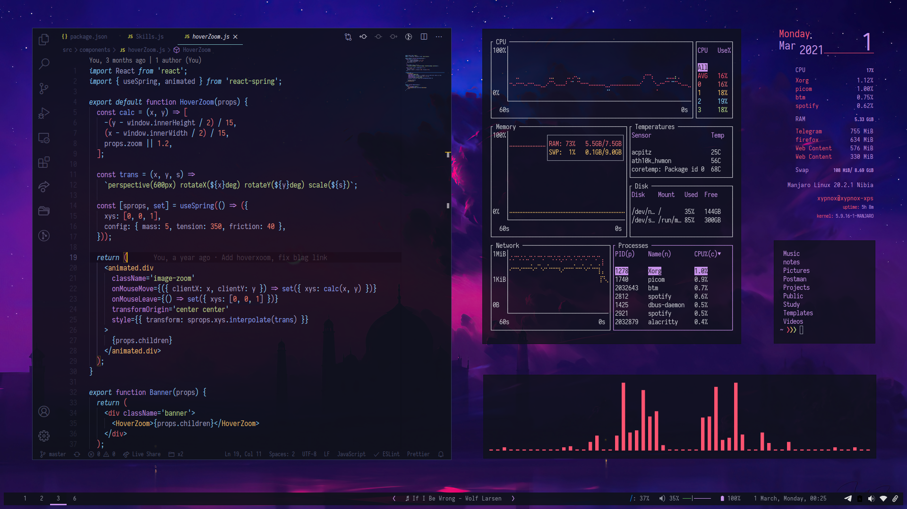
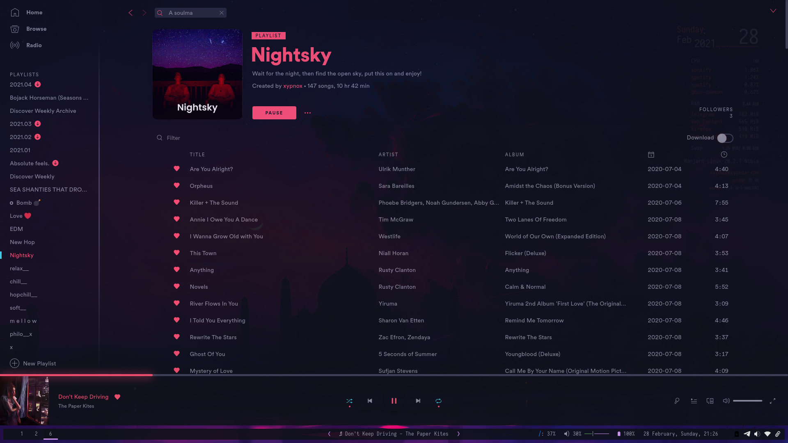
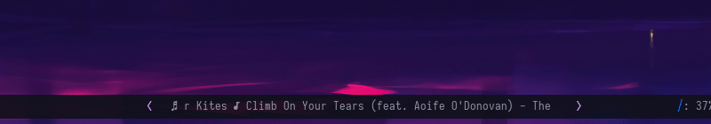
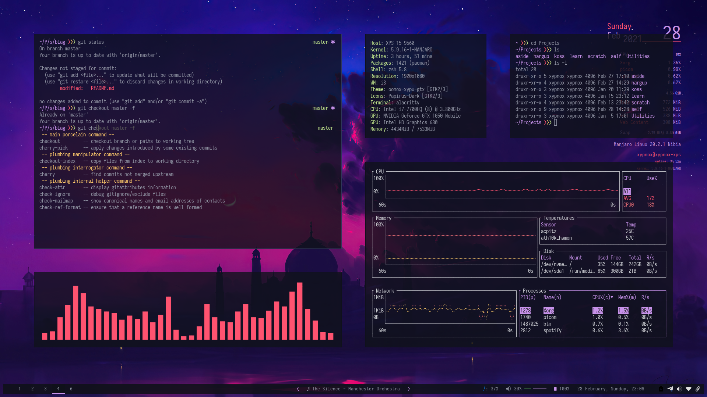

+++
title = "Glorious Endgame"
description = "A showcase of my endgame setup and some discussion on the things I discovered during the process."
date = 2021-03-02

[taxonomies]
categories = ["tech"]
tags = ["linux", "theme", "tech", "design"]

[extra]
metadata_image = "/posts/glorious-endgame/social.png"

+++


My endgame


I recently switched to [Manjaro i3](https://manjaro.org/download/#i3). And so far it has been my best experience with linux. I took my experience from customizing and tweaking ubuntu throughout the years into the final "endgame" setup I have now. And I have no intentions of switching things soon. Here is a showcase of my setup and some discussion on the things I discovered during the process.

I will cover customizations and workflows that I use with the current setup. I am welcome to all suggestions. Let's begin!

> **Rice**  
> "Rice" is a word that is commonly used to refer to making visual improvements and customizations on one's desktop.  

# Why customize

> We don't ask why, we ask why not.

There are a few things in life that you didn't know you wanted and you can't live without after you have experienced them. For some, myself included, ricing is one such thing.

The most popular thing is not necessarily the best one. 

If you use your computer for more than just web browsing, investing some time to make the experience better visually and functionally can go a long way.

In process of customization, you may discover ways of using and controlling your computer and applications that you didn't even fathom could exist.

Not everything comes free. You pay for the ability to customize with time. To have a desktop that you can be proud of, to have a desktop that looks so good that it inspires you to do stuff, you have to sacrifice time.

# Philosophy of Customization

> Minimalism is not a lack of something. It’s simply the perfect amount of something. — Nicholas Burroughs

These are the guidelines I strive for when I have to customize:

1. It should match the overall theme.
2. Dark mode >>> Light Mode.
3. Only show what is required all the time, all the time.
4. There should be one way to do things and that should be either:
   1. The Fastest way or
   2. The Easiest way
5. Keyboard >>> Mouse.

> I fear not the man who has practiced 10,000 kicks once, but I fear the man who has practiced one kick 10,000 times. - Bruce Lee

There might be 10,000 ways to do something, for example, open an application, play music, browse files, etc. But you have to choose the method that suits you and stick to it. With time you will master that way such that it will become second nature to you.

You shouldn't fight your desktop, you should harmonize with it. 

You shouldn't change yourself, you should change the desktop.

# Window Manager

Most people use the default [Desktop Environment](https://en.wikipedia.org/wiki/Desktop_environment) (DE) that comes with their linux distro. They change the widget/icon themes and the wallpapers and call it a day. Which is totally fine. That is how popular DEs, such as Gnome, are designed to be used. Everything a normal user needs is packed in with few theming choices for the adventurous. Gnome isn't meant to be heavily customized, it is a "use what you get" system. There is even a petition by GTK app developers to [stop theming altogether](https://stopthemingmy.app/).

On the other end of the spectrum are [Window Managers](https://en.wikipedia.org/wiki/Window_manager) (WM). It is purely responsible for controlling the layout, positioning, and styling of window borders. It's pointless to explain the benefits of WM over a DE here if you don't try out a WM yourself. It is much like explaining VR, you won't get it unless you try it out yourself. If you have Ubuntu installed you can try this [youtube tutorial for i3wm](https://www.youtube.com/watch?v=j1I63wGcvU4). I use a variant of [i3](https://i3wm.org/) called [i3-gaps](https://github.com/Airblader/i3), which allows for gaps between the windows.

If you do decide to try out a WM you will have to spend time learning it in the beginning. WMs are not the usual point and click tools most of us are used to. It will take time to get used to the keybindings. But once you do, navigating through windows and workspaces will be a breeze. You will be able to do almost everything via a keyboard.

`i3wm` is a tiling window manager, which means that new windows when opened don't overlap the existing window, rather the space is split and the new one takes half of it. This way, there is no overlap and everything is visible at once. You use workspaces, somewhat like multiple desktops to have many more windows open at a given amount of time. Each workspace can have any amount of windows and have any layout.

It can be said that using a WM is more of a change in the user experience, the way you interact with the software than UI. The UI is up to you. Customize it as heavily or as lightly as only you want. i3wm looks terrible in its default bare-bones state:

However, you can also start with a pre-configured version, for example, [Manjaro i3](https://manjaro.org/download/#i3), an Arch-based distro that comes prepackaged with i3-gaps, with a nice default theme and basic creature comforts. It looks like:

But you can go further to customize just about everything on it like the setup I have:

And the clean empty desktop:

Some go even further. You don't have to limit yourself to a specific WM. [DWM](http://dwm.suckless.org/), for example, is built to be extended and compiled by the user, so you can go to the code level and write specific functionality that you want for yourself. You can find several examples, of beautiful setups at [r/unixporn](https://www.reddit.com/r/unixporn/).

I stick to the i3-gaps variant myself for the following reasons:

1. It is one of the most popular of the window managers so getting support and configuration files for it is easier than others.
2. It is small in size and fast.
3. It is a tiling WM and supports flexible layouts including Tiling, Floating, Tabbed, etc. I mostly stick to tiling.
4. Some things might be better in more obscure WMs, but the tradeoff between switching and setting them up is *not* offset by the benefits they offer. I am currently very content with i3.

Another noticeable feature of i3 is the lack of window decoration. This saves the vertical space consumed by the title bar. You always know from the application itself what the application is, so the title is useless, and since the operations to manage windows are handled with keystrokes, the close button is not needed. And the minimize maximize buttons are useless for a tiling WM.

Apart from window layout and management, you need a way to start applications. I use the [rofi](https://github.com/davatorium/rofi) launcher, and it looks like this:

And that is the only way I open apps. You can search for the app and hit enter which will open the highlighted app. Opening stuff through rofi is extremely fast once you get used to it. There are predefined shortcuts in Manjaro i3 for browser and file explorer ([pcmanfm](https://wiki.archlinux.org/index.php/PCManFM))  and I only use the file explorer shortcut.

The bar at the bottom is [polybar](https://github.com/polybar/polybar). On the left side, it displays the opened workspaces and highlights the current workspace. On the center is the spotify song controls (discussed later), on the right are volume, storage, battery, and time indicators with the system tray icons at the end. Some people display current stats of CPU RAM etc on their polybar but I don't because I don't need that all the time. If you are wondering, yes the polybar is also hide-able!

# Firefox

The next step in customization is the browser. Chances are it is your most used software. So it does help to customize it as you will spend your time here more than anywhere else.

I riced my [firefox](https://www.mozilla.org/en-US/firefox/) for an extremely minimal experience. In its default state it looks like this:

Where is the navigation bar? How do you enter URL? What about bookmarks?

*The above image is a gif, watch the action!*

But where is the setting to tweak this? It is not a setting in firefox. You have to customize firefox's interface via CSS. The tabbar, navbar, etc are rendered from HTML, thus their appearance and functionality can be changed. You can head over to [r/FirefoxCSS](https://www.reddit.com/r/FirefoxCSS/) to see what people have been able to do with it. 

And yes, it is not available in any chrome based browser as of now because almost all of them use Native C/C++ for the browser UI, making it near impossible to customize.

Why no bookmark bar? What about icons in newtab to open the most used websites? Since the address-bar can be used to search the web, the history, and the bookmarks, there is no need to have a separate bookmarks tabbar, just search for it in the address-bar itself! and if you don't find it, the same term can then be searched on the web!

Why is this better than the standard look/UI? It saves vertical space. I see more of the website than the browser. Also, no one looks at the navbar unless they are already going to interact with it. You can either show it while hovering over the tabbar or use keyboard shortcuts to focus the address-bar. And opening a newtab automatically focuses the addressbar.

Moreover, I open new tabs rather than browse in a single tab, this way I can branch off and keep stuff in the tabbar that I may deal with later. This does consume more memory but is easier to navigate and I don't get in trouble unless I have 70, 80+ tabs with other apps open as well. Also opened tabs are a way of handling tasks, each tab is open for something. And once that something is done, it is closed. If that something has to be delayed, the tab can remain open, and since I restore my browser sessions, the next time I open the browser I get all the previously opened tabs.

The newtab is the [tabliss](https://tabliss.io/) extension which has been customized with a [background](https://github.com/xypnox/dotfiles/blob/master/wallpapers/newtab.png) I made specifically for the newtab. The font on the tab is [Jost](https://indestructibletype.com/Jost.html).

Apart from the key browser UI customizations, I have [stylus](https://github.com/openstyles/stylus) customizations for several websites to match the overall desktop theme. For example, here is twitter and youtube:

# Typora

My writing weapon of choice: [Typora](https://typora.io/). I take all my notes in markdown. No, I don't take notes of my physics classes, I take notes of everything else. Tech, programming, aesthetics, design, etc. All the stuff I write, blogs, poems, ideas, etc are first written on Typora and then migrated to their respective places. Here is how this paragraph looks while I edit it on Typora!

That is all I see when I type. I mostly use Typora in fullscreen for a nice distraction-free feel. With the combination of minimalism and a [mechanical keyboard](https://www.reddit.com/r/MechanicalKeyboards/), I can trick myself into thinking that the laptop is just an editing/writing machine, a modern typewriter so to speak.

And there is the sidebar, which when opened with a folder, lists all the files in a nested format. I have themed it so that it fades away and only focuses when hovered over. Minimal af.

The theme for Typora is [xydark](https://github.com/xypnox/xydark-typora).

# Spotify

[Spotify](https://www.spotify.com/us/download/linux/): The de facto music player!

With [Spicetify](https://github.com/khanhas/spicetify-cli) it matches my overall [theme](https://github.com/xypnox/dotfiles/tree/master/spicetify/Themes/xydark) and looks pretty rad. Apart from the basic spotify player, I also have the [spotify module](https://github.com/xypnox/dotfiles/blob/946cff63cc6378fad1f1af01c8191cd9ca0d461b/polybar/config#L384-L412) at the center of my polybar which controls the playback from any workspace. When the text is longer than a specified length, it even does a marquee scroll reminiscent of the old LED displays:

*The above image is a gif, watch the action!*

Apart from the visual details, I have also mapped the media controls of the keyboard to spotify play, pause, etc.

# Alacritty / Zsh / prezto

One of the benefits of using a tiling window manager is the ability to have several windows side by side. And the most opened window for a linux user is the terminal. 

I use [alacritty](https://github.com/alacritty/alacritty) as my terminal emulator for two reasons: It is fast, one of the fastest available terminals, and its configuration is a straightforward YAML file. There are more stripped-down terminals such as [URXVT](https://wiki.archlinux.org/index.php/Rxvt-unicode) but they are a pain to tweak and get just right.

For the shell I use [zsh](https://www.zsh.org/), which by itself is quite powerful. Many who use zsh use [oh-my-zsh](https://ohmyz.sh/) on top to give it that extra horsepower, I use an alternative, [prezto](https://github.com/sorin-ionescu/prezto). I like prezto because it is more stripped, hence faster than oh-my-zsh and its default shell prompt is just amazing.

Whatever you use with zsh, oh-my-zsh or prezto, what you definitely want to do is enable [zsh-autosuggestions](https://github.com/zsh-users/zsh-autosuggestions). It will save you a ton of time and make using the terminal a very enjoyable experience.

# VSCode

The only editor that I use at the moment. The entire color scheme of my system is inspired by the [material ocean dark](https://material-theme.site/) theme of [VSCode](https://code.visualstudio.com/). With the transparency and a few running terminals at the side the usual layout looks like this:

When I need more than two terminals, for example when also running the backend with frontend, and accessing the database, I group my terminals in another workspace and let VSCode have the full space of the screen.

VSCode has a zen mode which I was never excited to try out. The default UI of VSCode is already pretty minimal and I didn't want the hassle of switching modes back and forth to do anything other than editing. 

I have setup `Mod + Tab` as a keybinding in i3 to switch to the last opened workspace. This makes web development convenient as I can quickly switch between the VSCode workspace and the browser with a consistent keystroke. This can be used in other scenarios that require frequent switching between two workspaces.

# Telegram

[Telegram](https://desktop.telegram.org/) is my main tool for messaging because I use it for everything other than messaging. 

It is the only decent-looking, less resource-hungry app that can run in the background and has decent sync with the mobile app. Also, it is customizable af! Here is my [telegram theme](https://t.me/addtheme/elIs3i0CQbGoD1nM) on desktop (*Of course these are not the recent chats*):

# Basic Amenities

I also have added a little transparency to some of the applications such as: Typora, Spotify, VSCode, pcmanfm, etc via [picom](https://wiki.archlinux.org/index.php/Picom).

Also, I have preset keybindings for full screen and rectangular selection screenshots. You can checkout [scrot](https://github.com/resurrecting-open-source-projects/scrot) and [maim](https://github.com/naelstrof/maim) for your screen-capture use case. For gif recording, checkout [peek](https://github.com/phw/peek).

The widget on the desktop is a slightly tweaked version of a [conky](https://github.com/xypnox/dotfiles/tree/master/conky) that comes preinstalled with Manjaro i3. 

I use [bottom](https://github.com/clementtsang/bottom) for process management and system monitoring. Here are a bunch of terminals with gaps increased for aesthetics:

# The fault in our dotfiles

How wonderful the world of ricing is? Full of rainbows and sunshine. But it isn't perfect. 

There are several problems with my current setup:

- Firefox in fullscreen mode doesn't hide the tabbar.
- The icons of the system tray applet are hard to customize.
- The font of my choice, [Iosevka](https://github.com/be5invis/Iosevka/), due to its narrow width, has small nerd font characters.
- polybar's padding with single app open looks imperfect. (In a perfect world padding would only be there if more than two apps are open in a single workspace)
- The startup of i3, even though fast is still jarring, a smooth fade or growing animation, as found in Gnome would have been nice.
- My current file manager, pcmanfm doesn't support custom icons.
- Brightness controls are usable but not yet mapped to the external keyboard.
- Typora is sexy but has no git support, I would have liked to browse the history of documents inside Typora itself. (VSCode can be helpful here)

> “If you hear a voice within you say *you cannot customize*, then by all means customize and that voice will be silenced.”   
> ― Vimcent WM van Gtk

---

- [My dotfiles](https://github.com/xypnox/dotfiles)
- [r/unixporn](https://www.reddit.com/r/unixporn/) - The temple of ricing. Check the sub sidebar for further resources.
- [r/FirefoxCSS](https://www.reddit.com/r/FirefoxCSS/) - The place for Firefox customizations
- [darkreader](https://darkreader.org/) - make stuff dark.